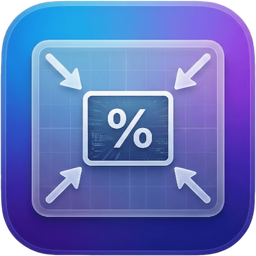

<p align="center">
  
</p>

<h1 align="center">ShrinkShot</h1>

<p align="center">
  <b>Auto-compress screenshots the moment they're saved.</b><br>
  A lightweight macOS menu bar app for AI-powered workflows.
</p>

<p align="center">
  <a href="https://github.com/matato-chan/ShrinkShot/releases/download/v1.0.0/ShrinkShot-1.0.0.dmg">
    
  </a>
  &nbsp;
  <a href="https://buymeacoffee.com/matato_chan">
    
  </a>
</p>

<p align="center">
  
  
  
</p>

<p align="center">
  Signed and notarized. Open the DMG, drag to Applications, done.
</p>

---

## What is ShrinkShot?

ShrinkShot lives in your menu bar and automatically compresses screenshots the moment they're saved. Perfect for pasting into **Claude, ChatGPT, Slack, or Notion** without hitting size limits.

Smaller images = fewer tokens = lower API costs.

## Features

- **One-click ON/OFF** — Menu bar toggle with visual icon change
- **Auto-compress** — Watches your screenshot folder and compresses new `.png` files
- **Customizable** — Scale percentage (10-100%) and JPEG quality
- **PNG or JPEG** — Keep original PNG or convert to JPEG for even smaller files
- **Global hotkey** — Toggle ON/OFF from anywhere with a custom keyboard shortcut
- **Launch at login** — Start automatically when you log in
- **Localized** — Japanese + English

## Installation

### Build from source

1. Clone the repository
   ```bash
   git clone https://github.com/matato-chan/ShrinkShot.git
   cd ShrinkShot
   ```

2. Install [xcodegen](https://github.com/yonaskolb/XcodeGen) if you don't have it
   ```bash
   brew install xcodegen
   ```

3. Generate the Xcode project and build
   ```bash
   xcodegen generate
   open ShrinkShot.xcodeproj
   ```

4. Build and run in Xcode (Product → Run)

## Usage

1. Click the menu bar icon to toggle auto-compression ON/OFF
   - **↘↖** = ON (compressing)
   - **↗↙** = OFF
2. Take a screenshot — it gets compressed automatically
3. Open **Settings** to customize scale, format, watch folder, and hotkey

## Settings

| Setting | Default | Description |
|---------|---------|-------------|
| Scale | 50% | Resize to percentage of original dimensions |
| Format | PNG | PNG (lossless) or JPEG (smaller) |
| JPEG Quality | 75% | Quality when JPEG is selected |
| Watch Folder | ~/Desktop | Folder to monitor for new screenshots |
| Hotkey | Not set | Global keyboard shortcut for ON/OFF |
| Launch at Login | OFF | Auto-start on login |

## Tech Stack

- Swift + SwiftUI
- NSImage / CoreGraphics for image processing
- FSEvents for folder monitoring
- Carbon RegisterEventHotKey for global hotkeys
- UserDefaults / @AppStorage for settings

## Requirements

- macOS 14 Ventura or later

## License

[MIT License](LICENSE)
